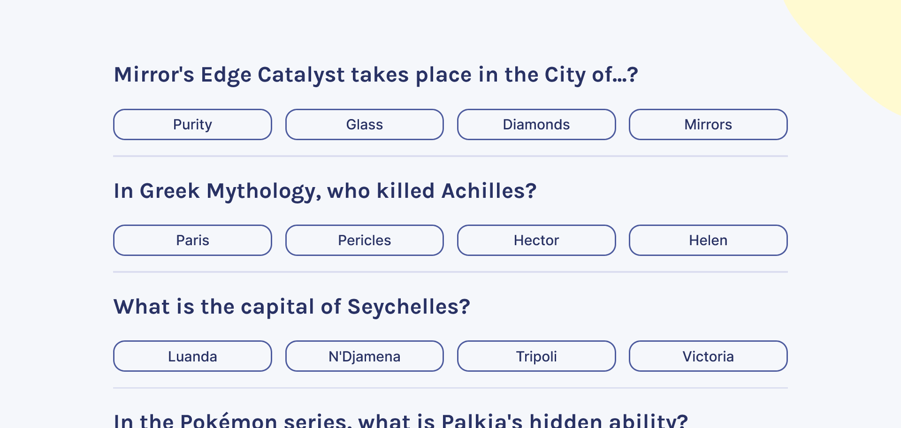

# 🚀 Quizzical


Test your knowledge with our engaging Trivia Quiz App. Challenge yourself with a wide range of categories. Start playing now and become a trivia master! 🚀



## 🔗 Links

- [Live Demo](https://julian-quizzical.vercel.app)
- [Open Trivia Database API](https://opentdb.com)

## 📐 Tech Stack

- Next.js
- Typescript
- Zustand
- react-loader-spinner
- axios
- sass
- he

## ✨ Usage

```bash
git clone https://github.com/piaseckijulian/Quizzical.git
cd Quizzical
pnpm dev
```

That's it! - You're good to go. You can add new features, fix bugs etc.

## 🌐 Contribution

If you want to contribute to this amazing project simply raise an **Issue** when you found a bug or you are requesting a new feature. However if you want to do it yourself create a **Pull Request**.

## ⭐ Credits

This is the Final Solo Project of [Bob Ziroll's](https://twitter.com/bobziroll) [React Course](https://scrimba.com/learn/learnreact)
