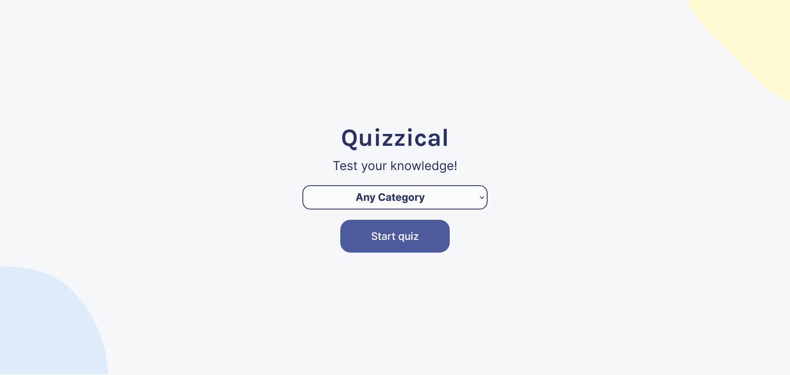

# Quizzical - ⭐Trivia Quiz App

Test your knowledge with our engaging Trivia Quiz App. Challenge yourself with a wide range of categories. Start playing now and become a trivia master!

# Home Screen

 

# Quiz Screen

 

# About

I built this project with:

- [Next.js](https://www.npmjs.com/package/next)
- [Typescript](https://www.npmjs.com/package/typescript)
- [Redux](https://www.npmjs.com/package/react-redux)
- [Redux Toolkit](https://www.npmjs.com/package/@reduxjs/toolkit)
- [Axios](https://www.npmjs.com/package/axios)
- [he](https://www.npmjs.com/package/he)
- [React Loader Spinner](https://www.npmjs.com/package/react-loader-spinner)

## API

- [Open Trivia Database](https://opentdb.com/)
 
- Endpoint: https://opentdb.com/api.php?amount=5

# [Live Demo](https://julian-quizzical.vercel.app)

# Credits

This is the Final Project of **[Bob Ziroll](https://twitter.com/bobziroll)**'s **[React Course](https://scrimba.com/learn/learnreact)** on **[Scrimba](https://scrimba.com)**

[Design Files](https://scrimba.com/links/figma-quizzical)
